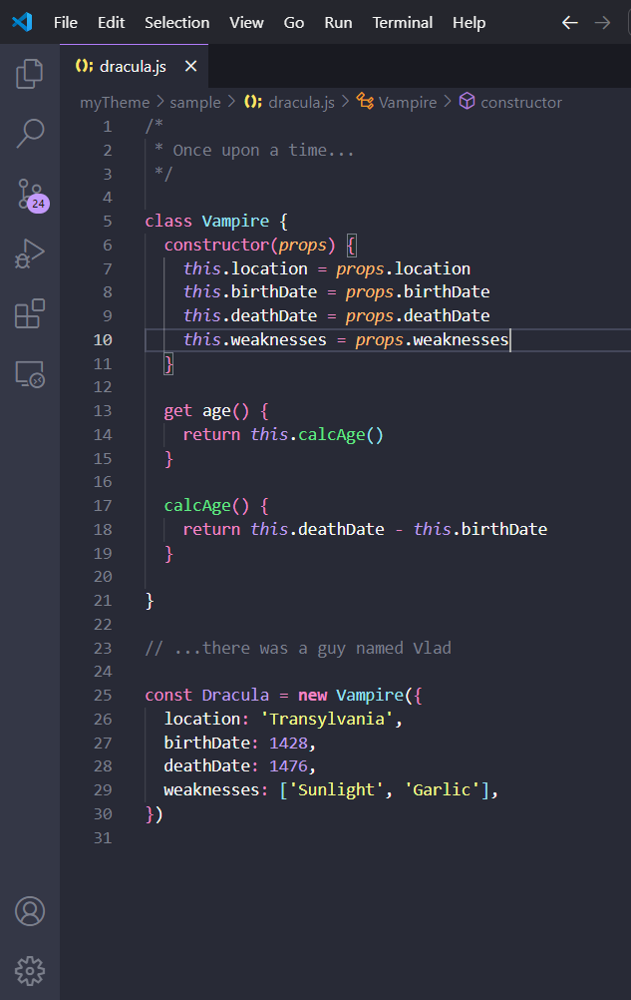
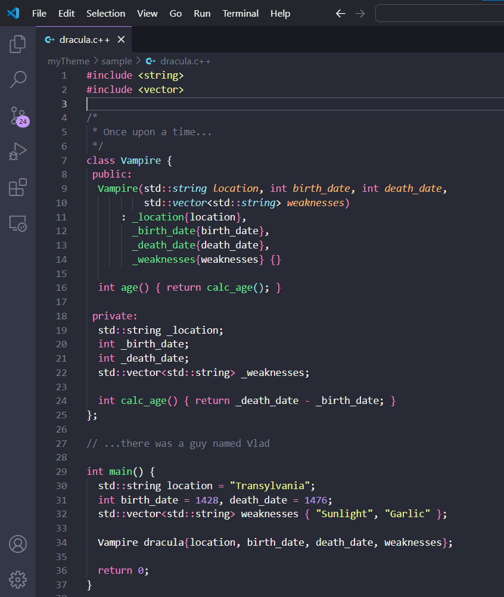

# Soft Dracula Theme but my version

Hey, this is a theme that I modified, I didn't create it. I made some changes that I liked at the moment. I'm not a designer so it might not be great but I like it.

## Render to Caesar the things that are Caesar's

This theme is derived from the soft version of the official [Dracula Theme for VS Code](https://draculatheme.com/visual-studio-code) and I downloaded the icon from the [GitHub Repo](https://github.com/dracula/visual-studio-code/blob/master/icon.png). I generated two json files from the yaml file in the [Dracula GitHub repository](https://github.com/dracula/visual-studio-code) (one normal and one soft) but only modified the soft.

I'll try to give access to these json files. But I don't know how to do it right now (I'm new to extensions). I'll make an update when it's okay.

**Enjoy!**

## Screenshots

* JavaScript : 
* C++ : 

